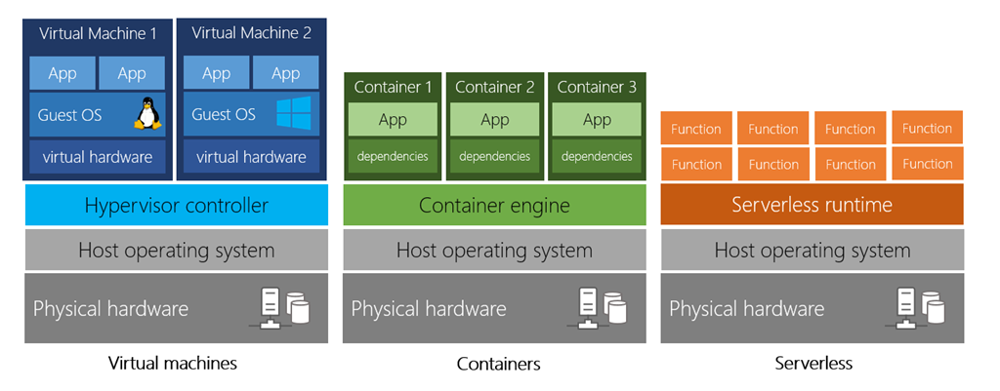
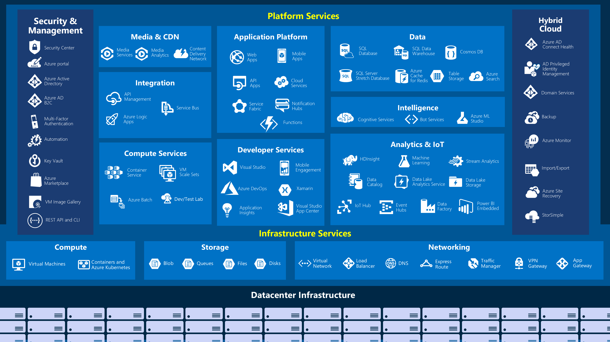

# Azure Fundamentals Notes

Notes for the course [Azure Fundamentals](https://docs.microsoft.com/en-us/learn/paths/azure-fundamentals/). Both content and images are extracted from there.

## Principles of Cloud Computing

 
Show content

### Learning Objectives

* Common cloud computing services
* Benefits of cloud computing
* Cloud deployment model

### What is cloud computing?

It's a resource rental based on a pay per use approach, abstracting the hardware from the users.

### Cloud Computing Services

#### Compute Power

It is the processing capability offered by cloud-based servers. Depending on our needs, we can chose among three different options:

* **Virtual Machines (VM)**: You are provided the hardware and the OS, but have to control and maintain the rest of the software. This VM will run on a physical server based on a datacenter and overall resources will be shared with other VMs in an isolated and secure fashion.

* **Containers**: Such as Docker, offer an independent, consistent and isolated execution environment for applications. They do not require any OS - as they just contain the minimum dependencies to run the app - they are easy and fast to spin up, move to a different machine and scale.

* **Serverless Computing**: Is the ability to run an application without creating, configuring nor maintaining a server. By breaking the whole application into smaller pieces, we can define a workflow and a set of triggers to execute the different parts of the application.

As per **pricing**, with VMs and Containers, we pay for as long the server is up, eventhough the application is idle. With Serverless Computing though, you only pay for the processing time of each function.

#### Storage

If you either need to store a file or use a database, cloud providers offer the possibility to scale the storage as per your needs.

#### Summary

As requirements vary among all the processes and services business needs to offer, cloud computing is a **flexible** and **cost-efficient** solution to both small or big companies.

### Benefits of Cloud Computing

* **Cost-Effective**: with a pay-as-you-go model you don't need to make huge upfronts investments to start offering your services. Moreover, you don't need to manage any kind of infrastructure, freeing people to focus on other tasks.

* **Scalable**: It's easy to increase / decrease the resources used either manually or automatically.
    * *Vertical Scaling* or *scaling up* can be used to increase the power of an existing machine.
    * *Horizontal Scaling* or *scaling out* adds more servers to function together as a unit.

* **Elastic**: Can automatically adapt to workload changes by adding or removing resources.

* **Current**: By removing the need of managing hardware and other IT tasks, you can focus on just building and deploying your apps.

* **Reliable**: As it offers backups, disaster recovery and data replication services to make sure that your data is always safe. If on top you follow redudancy on your architectures you can avoid single points of failure.

* **Global**: With datacenters all over the globe, you can have presence close to your customers and reduce response time.

* **Secure**: Offering policies, technologies and controls.

### Compliance terms and requirements

Cloud providers should also help when complying with regulations and standards such as GDPR.

### Economies of Scale

The ability to do things at a lower cost per unit when operating at a larger scale.

### Capital expenditure (CapEx) versus operational expenditure (OpEx)

* **Capital Expenditure (CapEx)**: Spending of money on physical infrastructure up front, and then deducting that expense from your tax bill over time. This is the example of on-premise servers, where one needs to pay for server, storage, network, backup, disaster recovery and general infrastructure costs for both software and hardware plus the technical personnel.

* **Operational Expenditure (OpEx)**: Spending money on services or products now and being billed for them now. With cloud computing we can access to more customized features as we're not sharing the same framework for everyone. Charges are scalable based on usage rather than having a fixed capacity and the billing can directly by focused to a user or organization level.

### Cloud deployment models

A cloud deployment model defines where the data is stored and how customers interact with it.

* **Public Cloud**: No local hardware - everything runs on the cloud provider. It implies the following **advantadges**:
    * Scalability and agility, as you just rent more hardware when needing it.
    * Pay-as-you-go pricing: no CapEx.
    * No need for hardware maintenance.
    * Minimal technical knowledge to set up and use.

    However, there also are some **disadvantages**:
    * Maybe you are not able to manage the hardware as you'd want.
    * It's possible that some security requirements, policies or standards that cannot be met.
    * Unique business requirements - such as maintaining a legacy application - might be hard to meet.

* **Private Cloud**: You set up the whole datacenter, access policies and resources in the organization. This has some **advantages**:
    * You can configure it so that it's possible to maintain any legacy app.
    * Full control (and responsability) over security.
    * Easier to meet security, policy and standards.

    The **disadvantages** would be:
    * Initial CapEx costs.
    * Limited agility.
    * High IT skills.

* **Hybrid Cloud**: Combination of Public and Private clouds, which brings both worlds advantages which may be benefitial for some applications or configurations but also can end up being more expensive and hard to manage.

### Types of Cloud Services

* **IaaS**: Most flexible category, giving full control on the hardware that runs the app.
    > **Shared repsonsibility model**: Ensuring that a service is running is a shared responsibility between the cloud provider (in charge of the infrastructure) and the customer (who needs to set up the proper configurations).
    This is the usual scenario when migrating workloads - as you can mimic on-premise setup, testing and deployment for new apps and for storage, backup and recovery.

* **PaaS**: Provides an environment for building, testing and deploying software applications, where one does not need to care about the underlying infrastructure. It is useful as it brings a framework that developers can work upon and also for analytics or BI tasks.

* **SaaS**: Software hosted and managed for the customer, who acts as end user.

### Knowledge Check

1. Which term from the list below would be viewed as benefits of using cloud services?

* Unpredictable costs
* Elasticity
* Local reach only

    

    
 
    Answer
    

    

    Elasticity: Elasticity, Agility and Economies of scale are the correct answers, and would be seen as benefits that you can gain from using cloud services.
    

    

2. Suppose you have two types of applications: legacy applications that require specialized mainframe hardware and newer applications that can run on commodity hardware. Which cloud deployment model would be best for you?

* Public cloud
* Private cloud
* Hybrid cloud

    

    
 
    Answer
    

    

    Hybrid cloud: A hybrid cloud is a public and private cloud combined. You can run your new applications on commodity hardware you rent from the public cloud and maintain your specialized mainframe hardware on-premises.
    

    

3. You're developing an application and want to focus on building, testing, and deploying. You don't want to worry about managing the underlying hardware or software. Which cloud service type is best for you?

* Infrastructure as a Service (IaaS)
* Platform as a Service (PaaS)
* Software as a Service (SaaS)

    

    
 
    Answer
    

    

    Platform as a Service (PaaS): Platform as a Service is the best choice here because the PaaS services handle the IT management tasks for you, so you can focus on writing code.
    

    

---

## Introduction to Azure

 
Show content

### Learning Objectives

* What Microsoft Azure is.
* Deploy and configure a web server.
* Learn how to scale up your server.
* Interact with the web server using Azure Cloud Shell.

### Tour of Azure services

Azure is Microsoft's cloud computing platform.

It offers a lot of services of different nature:

* **Compute**: helping in hosting applications and services.
* **Networking**: for linking resources and providing access to applications.
* Four main types of **storage**: Blob storage, File storage, Queue storage and Table storage (NoSQL store).
* **Mobile**: to create services for iOS, Android an Windows.
* **Databases** with global connectivity.
* Building and hosting **Web** applications.
* **IoT** data gathering and analysis.
* Analytics solutions for **Big Data**.
* **AI**: helping with creating and deploying ML models.
* **DevOps** services for building, testing and releasing your applications.

### Exercise - Create a website hosted in Azure

> In this section, it is useful to directly access Azure course and work with the given [sandbox](https://docs.microsoft.com/en-us/learn/modules/welcome-to-azure/4-exercise-create-website). It does not charge your subscription.

* **App Service**: HTTP-based service that enables you to build many types of web-based solutions without managing the infrastructure. With an App Service Plan we specify the compute resources and location for the web app.

* **Azure Marketplace**: Online store that hosts certified and optimized applications to run in Azure, for example Wordpress in an App Service.

### Exercise - Configure an App Service

> In this section, it is useful to directly access Azure course and work with the given [sandbox](https://docs.microsoft.com/en-us/learn/modules/welcome-to-azure/5-exercise-configure-app-service). It does not charge your subscription.

By looking at the performance graphs we can check if we need to perform any changes on the configuration of our app. When **scaling** a webb app, we could add network bandwidth, memory, storage or compute power.

> **Azure Advisor** and **Azure Cost Management** are two services that help you optimize cloud spend. You can use these services to identify where you're using more than you need, and then scale back to the capacity you're actually using.

Finally, notice that there are three categories of configurations plans to make it easier to define our setup for dev, prod or isolated workloads.

> **Isolated**:	This category is ideal for workloads that require advanced networking and fine-grained scaling.

### Exercise - Access an App Service using Azure Cloud Shell

> In this section, it is useful to directly access Azure course and work with the given [sandbox](https://docs.microsoft.com/en-us/learn/modules/welcome-to-azure/6-exercise-cloud-shell). It does not charge your subscription.

**Azure Cloud Shell** is a browser-based command-line experience for managing and developing Azure resources

### Knowledge Check

1. What is Azure?

* Microsoft's cloud computing platform, which provides compute power, storage, and services over the Internet using a pay-as-you-go pricing model.
* A single data center located in Redmond, Washington.
* A hosting environment specifically for virtual machines

    

    
 
    Answer
    

    

    Microsoft's cloud computing platform, which provides compute power, storage, and services over the Internet using a pay-as-you-go pricing model: Azure provides raw compute power and storage, as well as services to help you explore new software paradigms such as intelligent bots and mixed reality. 
    

    

2. Which of the following is an example of an Azure application platform?

* Azure App Service
* Azure Load Balancer
* Azure Table Storage
* Azure Cache for Redis

    

    
 
    Answer
    

    

    Azure App Service: Azure App Service is an HTTP-based service that enables you to build and host many types of web-based solutions without managing infrastructure. 
    

    

3. When should you scale out your deployment?

* When your application or service requires a more powerful CPU or more memory to run faster.
* When you need additional virtual machines to speed up your application.
* When you're using excess capacity that you don't need.

    

    
 
    Answer
    

    

    When you need additional virtual machines to speed up your application: Scaling out means adding additional systems, such as virtual machines. For example, you might create many virtual machines configured in the same way and use a load balancer to distribute work across them. 
    

    

---

